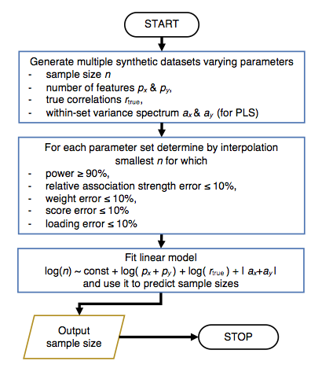
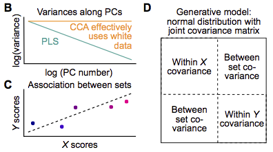
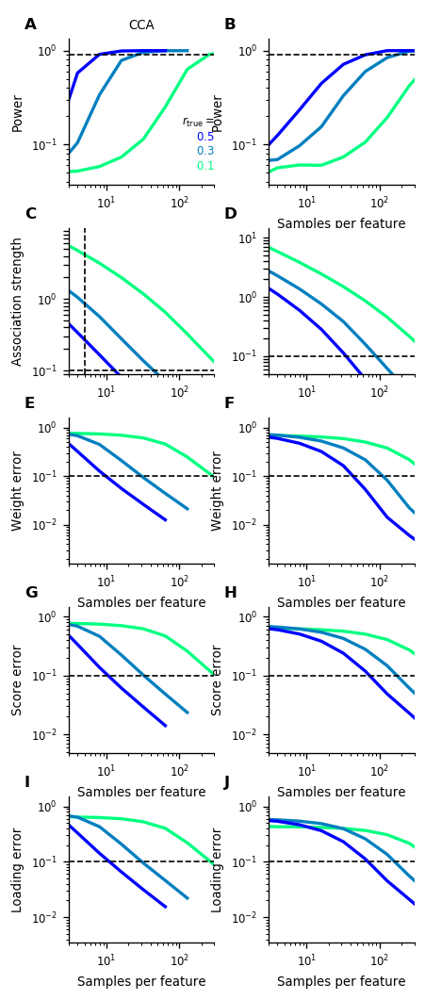

.. _how_it_works:

How it works
============

To determine a required sample size *gemmr* uses the following steps

We briefly explain these steps in the following. For more details please refer
to the [gemmr]_ publication.

First, a joint covariance matrix for :math:`X` and :math:`Y` is constructed
with dimension :math:`(p_X+p_Y) \times (p_X + p_Y)`.
The upper left block of size :math:`p_X \times p_X` represents the covariance
matrix for dataset :math:`X`. We assume it is diagonal (which is equivalent
to saying that a principal component analysis has been applied beforehand)
and the entries on the diagonal, :math:`d_i` decay with a power-law dependence
as :math:`d_i=i^{a_X}` (we assume that :math:`a_X < 0`). For dataset :math:`Y`
we make analogous assumptions, i.e. that the lower right block of the joint
covariance matrix with dimension :math:`p_Y \times p_Y` is diagonal and the
entries are modeled as :math:`i^{a_Y}` with :math:`a_Y < 0`. The upper right
and lower left block of the joint covariance matrix encode the association
between datasets :math:`X` and :math:`Y` and are constructed such that the
correlation between the optimized linear composites of :math:`X`
(:math:`X` scores) and linear composites of :math:`Y` (:math:`Y` scores) is
:math:`r_\mathrm{true}`. The joint covariance matrix determines a multivariate
normal distribution. Synthetic datasets :math:`X_\mathrm{synth}`,
:math:`Y_\mathrm{synth}` of size :math:`n \times p_X` and :math:`n \times p_y`,
respectively, are generated by sampling from this normal distribution. Each
synthetic dataset is analyzed with CCA or PLS and statistical power as well as
errors of estimated association strength, weights, scores and loadings
(compared to their true values, which we know as they are determined by the joint
covariance matrix that we constructed) are calculated.

Second, for given :math:`p_X, p_Y, a_X` and :math:`a_Y` synthetic datasets of
varying size :math:`n` are generated and the smallest :math:`n` is determined
for which statistical power and error metrics reach a target level of 90% and
10%, respectively.

Third, as the computational expense to repeatedly analyze synthetic datasets
is high we have performed the outlined calculations for a number of parameter
values and have then fitted a linear model to be able to quickly predict
sample sizes.
