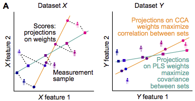

Overview
========

What are *CCA* and *PLS*?
-------------------------

Canonical Correlation Analysis (CCA) and Partial Least Squares (PLS) are methods
that reveal associations between multivariate datasets.
Commonly, associations are assessed with (e.g.) the Pearson correlation coefficient between two features.
When datasets have a multitude of features, however, pairwise associations focus on only narrow aspects
in the data and multivariate methods that take into account all features at the same time can be advantageous.
CCA and PLS do that by determining weighted composites of the features such that the association strength
between the weighted composites is optimal: CCA maximizes the correlation, PLS maximizes the covariance.

What problems can occur with CCA and PLS?
-----------------------------------------

When only a small number of samples are available, CCA and PLS can overfit the data. To demonstrate this, we
use an example dataset

.. ipython:: python
    :okwarning:

    from sklearn.datasets import load_linnerud
    X, Y = load_linnerud(return_X_y=True)
    X.shape, Y.shape

CCA determines weights for each feature such that the weighted sums of features in both datasets correlate maximally.
Solely to be able to illustrate better the resulting weights, let us use use only 2 of the three features in ``X``

.. ipython:: python

    X = X[:, :2]

and perform CCA on random subsamples of small size

.. ipython:: python

    from gemmr.estimators import SVDCCA
    cca = SVDCCA()

    n_iter = 3000
    n_subsamples = 6
    np.random.seed(0)
    x_weights_6 = np.empty((n_iter, 2))
    corrs_6 = np.empty(n_iter)
    for i in range(n_iter):
        inds = np.random.permutation(len(X))[:n_subsamples]
        cca.fit(X[inds], Y[inds])
        corrs_6[i] = cca.corrs_[0]
        x_weights_6[i] = cca.x_rotations_[:, 0]

And, for comparison, we're repeating the same analysis using 12 instead of 6 samples in each iteration

.. ipython:: python

    n_subsamples = 12
    x_weights_12 = np.empty((n_iter, 2))
    corrs_12 = np.empty(n_iter)
    for i in range(n_iter):
        inds = np.random.permutation(len(X))[:n_subsamples]
        cca.fit(X[inds], Y[inds])
        corrs_12[i] = cca.corrs_[0]
        x_weights_12[i] = cca.x_rotations_[:, 0]

Let's now look at the estimated canonical correlations

.. ipython:: python

    plt.violinplot([corrs_6, corrs_12])
    plt.ylabel('estimated canonical correlation')
    @savefig estim_canonical_corr_violins.png width=4in
    plt.xticks([1, 2], ['6 samples', '12 samples'])

When CCA was performed on samples of size 6 the estimated canonical correlations almost always were essentially 1!
This seems unrealistic in practice and in fact when the sample size is doubled estimated canonical correlations drop
noticably. Beyond that, it's not clear what canonical correlations we would get if we had a larger (or infinite)
sample size at our disposal. This aspect of how canonical correlations depend on sample size is further investigated in
the :ref:`analyses_from_paper`.

Let's now look at the estimated weight vectors. Note that CCA weights are ambiguous with respect to their signs.
Therefore, for consistency, we here arbibtrarily choose the signs of the weights such that the second element of the
weight vectors is positive

.. ipython:: python

    x_weights = x_weights_12
    x_weights *= np.sign(x_weights[:, [1]])

Then, we can illustrate the weights

.. ipython:: python

    import matplotlib.pyplot as plt
    plt.scatter(x_weights[:, 0], x_weights[:, 1], s=5)
    @savefig cca_overfit_weights.png width=4in
    plt.gca().set_aspect(1)

Each point in this plot represents a weight vector. As each of the 2-dimensional weight vectors are normalized to unit
length they necessarily need to lie on a circle with radius 1. What's surprising here, is that the weight vectors cover
the *whole* circle (semi-circle, as the second element was constrained to be positive). This means that the estimated
weight vector can be *every possible* weight vector, depending on which particular data sample was measured. I.e., the
inferred weights are completely unreliable in this scenario. As for the canonical correlations, it is unclear what
weight vectors we would obtain if we had a larger (or infinite) data sample. However, for CCA to be useful, i.e. for the
weights to be interpretable, we need reliable weight estimates.

To obtain reliable estimates for the canonical correlations and weight vectors, samples of sufficient size are required
and *gemmr* provides functionality to determine this size.

What does *gemmr* do?
----------------------

*gemmr* assists in determining an appropriate sample size for a CCA or PLS analysis. It does so by generating synthetic
data, performing CCA / PLS on the synthetic data sample and evaluating how close the results are to the truth. To that
end, *gemmr* provides functionality to

* generate synthetic data with known parameter dependencies
* perform CCA and PLS
* evaluate parameter dependencies of CCA / PLS results
* determine appropriate sample sizes

The main parameters of interest on which CCA / PLS results depend and which are needed to generate synthetic data are

* the dimensionality of the data
* the assumed true association strength between weighted composites of the datasets
* the within-set variance structure, i.e. the principal component variance spectrum in each dataset
* the sample size

For more information, see :ref:`how_it_works`, :ref:`analyses_from_paper`, as well as the [gemmr]_ publication.

.. [gemmr] Helmer et al., ...
